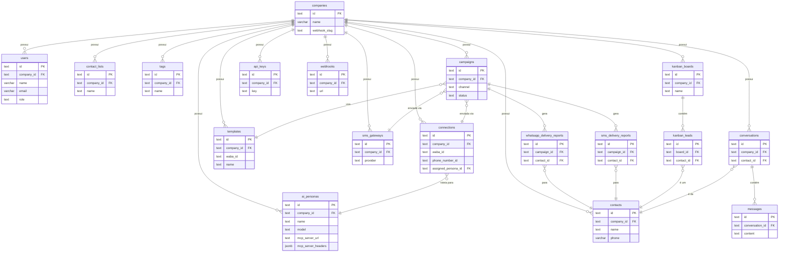

# Documentação da Base de Dados - ZAP Master

Este documento detalha a arquitetura e o schema da base de dados PostgreSQL utilizada pelo ZAP Master. O schema é gerido através do Drizzle ORM, e os ficheiros de definição encontram-se em `src/lib/db/schema.ts`.

## 1. Diagrama Entidade-Relacionamento (ERD)

## 2. Descrição das Tabelas

| Tabela | Colunas Principais | Função |
|---|---|---|
| `companies` | `id`, `name`, `webhook_slug` | Tabela central para multi-tenancy. Cada empresa é um inquilino isolado. |
| `users` | `id`, `company_id`, `email`, `password`, `role` | Armazena os utilizadores da plataforma, suas credenciais e permissões. |
| `password_reset_tokens` | `user_id`, `token_hash`, `expires_at` | Armazena tokens seguros para a funcionalidade de redefinição de senha. |
| `email_verification_tokens` | `user_id`, `token_hash`, `expires_at` | Guarda os tokens para a verificação de e-mail de novos utilizadores. |
| `connections` | `id`, `company_id`, `waba_id`, `phone_number_id`, `access_token`, `assigned_persona_id` | Armazena as credenciais para cada conexão com a API do WhatsApp e o agente de IA para o qual o atendimento é roteado. |
| `ai_personas`| `id`, `company_id`, `name`, `model`, `mcp_server_url`, `mcp_server_headers` | Define os diferentes agentes de IA, suas personalidades, modelos e as ferramentas externas (MCP) que podem usar. |
| `contacts` | `id`, `company_id`, `name`, `phone` | O CRM da aplicação, armazenando a lista de todos os contatos. |
| `contact_lists` | `id`, `company_id`, `name` | Tabela para agrupar contatos em listas de marketing ou segmentação. |
| `tags` | `id`, `company_id`, `name`, `color` | Permite a categorização de contatos com etiquetas coloridas. |
| `templates` | `id`, `company_id`, `waba_id`, `name`, `body`, `status` | Armazena os modelos de mensagem do WhatsApp, sincronizados da API da Meta. |
| `media_assets` | `id`, `company_id`, `name`, `s3_url` | Catálogo de mídias (imagens, vídeos, docs) para uso em campanhas. |
| `campaigns` | `id`, `company_id`, `channel`, `status`, `scheduled_at` | Regista todas as campanhas, sejam de WhatsApp ou SMS. |
| `sms_gateways` | `id`, `company_id`, `provider`, `credentials` | Configurações para os diferentes provedores de envio de SMS. |
| `whatsapp_delivery_reports`| `campaign_id`, `contact_id`, `status` | Log detalhado para cada envio de mensagem de WhatsApp numa campanha. |
| `sms_delivery_reports`| `campaign_id`, `contact_id`, `status` | Log detalhado para cada envio de mensagem de SMS numa campanha. |
| `kanban_boards` | `id`, `company_id`, `name`, `stages` | Define a estrutura de um funil Kanban, com suas colunas (etapas). |
| `kanban_leads` | `id`, `board_id`, `contact_id`, `stage_id`, `value` | Representa um lead (contato) dentro de uma etapa de um funil Kanban. |
| `conversations` | `id`, `company_id`, `contact_id`, `status` | Tabela central para a funcionalidade de atendimento (inbox). |
| `messages` | `id`, `conversation_id`, `sender_type`, `content` | Armazena cada mensagem individual trocada numa conversa. |
| `api_keys` | `id`, `company_id`, `key`, `name` | Permite a criação de chaves de API para integrações externas. |
| `webhooks` | `id`, `company_id`, `url`, `event_triggers` | Permite que sistemas externos sejam notificados sobre eventos no ZAP Master. |

## 3. Observações

- **Índices:** Existem índices nas colunas de chaves estrangeiras (`*_id`) e em colunas frequentemente usadas em cláusulas `WHERE`, como `contacts.phone` e `users.email`.
- **Constraints:** A constraint de unicidade `contacts_phone_company_id_unique` é crucial para evitar contatos duplicados dentro da mesma empresa.
- **Segurança:** Dados sensíveis como `connections.access_token` e `sms_gateways.credentials` são encriptados na aplicação antes de serem persistidos no banco.
- **MCP Config:** As configurações do MCP Server (`mcp_server_url`, `mcp_server_headers`) são armazenadas por `ai_persona`, permitindo que diferentes agentes usem diferentes conjuntos de ferramentas.
