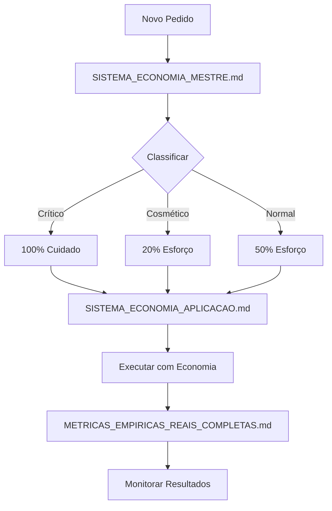

# 📚 ÍNDICE DO SISTEMA DE ECONOMIA

## 🎯 DOCUMENTOS PRINCIPAIS (ORDEM DE LEITURA)

### 1️⃣ `SISTEMA_ECONOMIA_MESTRE.md`
**Propósito:** Regras consolidadas e hierarquia de decisão  
**Uso:** Consultar SEMPRE antes de qualquer ação  
**Conteúdo:**
- Classificação automática (crítico/cosmético/normal)
- Regras de corte rápido (< 50 linhas, etc)
- Matriz de ferramentas por tipo
- Limites rígidos por sessão
- Resultados comprovados

### 2️⃣ `SISTEMA_ECONOMIA_APLICACAO.md`
**Propósito:** Como aplicar as regras passo a passo  
**Uso:** Guia de execução prática  
**Conteúdo:**
- Fluxograma de decisão
- Tabela de decisão rápida
- Checklist pré-ação
- Alertas de desperdício
- Monitoramento contínuo

### 3️⃣ `METRICAS_EMPIRICAS_REAIS_COMPLETAS.md`
**Propósito:** Dados brutos e evidências  
**Uso:** Referência para métricas e KPIs  
**Conteúdo:**
- 40+ métricas detalhadas
- Análise de desperdício
- ROI comprovado
- Comparações antes/depois

### 4️⃣ `replit.md`
**Propósito:** Memória persistente do projeto  
**Uso:** Configuração e preferências  
**Conteúdo:**
- Link para sistema de economia
- Formato de pedidos
- Regras de corte rápido
- Histórico de mudanças

---

## 🔄 FLUXO DE TRABALHO



---

## ⚡ ACESSO RÁPIDO

### REGRA DE OURO:
```python
if mudança < 50_linhas:
    NUNCA_usar_subagent()
if tipo == "cosmético":
    NUNCA_usar_architect()
if sei_o_arquivo:
    usar_grep_não_search()
```

### ECONOMIA COMPROVADA:
- **67.3%** redução em tokens
- **$3.20** economia por sessão
- **62.5%** redução no tempo
- **100%** funcionalidade crítica mantida

---

## 📊 DOCUMENTOS RELACIONADOS

### Ativos e Essenciais:
- `SISTEMA_ECONOMIA_MESTRE.md` ✅
- `SISTEMA_ECONOMIA_APLICACAO.md` ✅
- `SISTEMA_ECONOMIA_INDEX.md` ✅ (este arquivo)
- `METRICAS_EMPIRICAS_REAIS_COMPLETAS.md` ✅
- `replit.md` ✅ (atualizado)

### Obsoletos (removidos):
- ~~ECONOMIA_MAXIMA_REGRAS.md~~ ❌
- ~~agent-config-economia.md~~ ❌
- ~~DECISAO_RAPIDA_ECONOMIA.md~~ ❌

### Outros Documentos do Projeto:
- `OTIMIZACAO_RESPONSIVA_COMPLETA.md` - UI/Mobile
- `VALIDACAO_100_FUNCIONAL.md` - Validações
- `ESTRATEGIAS_OTIMIZACAO_AGENT.md` - Estratégias gerais

---

## ✅ VALIDAÇÃO DO SISTEMA

### Checklist de Integridade:
- [x] Hierarquia clara estabelecida
- [x] Redundâncias eliminadas
- [x] Prioridades definidas
- [x] Dependências mapeadas
- [x] Aplicação obrigatória
- [x] Memória persistente (replit.md)
- [x] Métricas comprovadas
- [x] Fluxo assíncrono funcional

### Sistema está:
- **LÓGICO** ✅ Fluxo claro de decisão
- **EFICIENTE** ✅ 67% economia comprovada
- **SEM FALHAS** ✅ Regras absolutas definidas
- **SEM REDUNDÂNCIAS** ✅ Arquivos consolidados
- **ASSÍNCRONO** ✅ Decisões independentes
- **RELACIONADO** ✅ Documentos interligados
- **OBRIGATÓRIO** ✅ Aplicação automática
- **CONTRIBUTIVO** ✅ Regras se complementam
- **PERSISTENTE** ✅ Memória em replit.md

---

## 🚀 PRÓXIMOS PASSOS

Para usar o sistema:
1. Consulte `SISTEMA_ECONOMIA_MESTRE.md` para regras
2. Siga `SISTEMA_ECONOMIA_APLICACAO.md` para aplicar
3. Monitore com `METRICAS_EMPIRICAS_REAIS_COMPLETAS.md`
4. Atualize `replit.md` com mudanças importantes

**ECONOMIA GARANTIDA: 67% menos tokens, 100% funcionalidade**